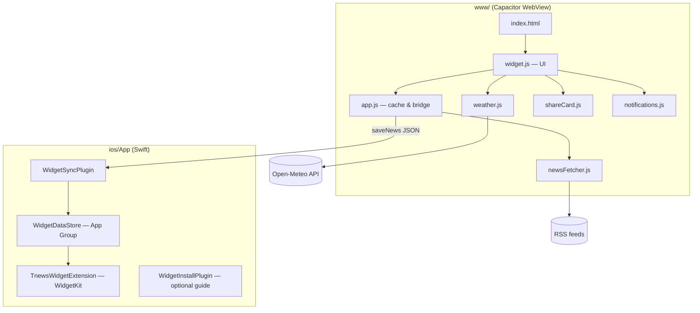

# Tnews Widget — Project Documentation

**Repository:** [github.com/ziedsG1/Tnewsipa](https://github.com/ziedsG1/Tnewsipa)  
**Current iOS version:** 2.0.1  
**Bundle ID:** `tn.tnews.widget`  
**Display name:** Tnews Widget  

This document describes the full project: purpose, architecture, features, how to build and install, and how to maintain the codebase.

---

## Table of contents

1. [Overview](#1-overview)
2. [Features](#2-features)
3. [Architecture](#3-architecture)
4. [Project structure](#4-project-structure)
5. [Web application layer](#5-web-application-layer)
6. [News and data pipeline](#6-news-and-data-pipeline)
7. [iOS native layer](#7-ios-native-layer)
8. [Configuration reference](#8-configuration-reference)
9. [Development workflow](#9-development-workflow)
10. [Building and installing on iPhone](#10-building-and-installing-on-iphone)
11. [User guide](#11-user-guide)
12. [Troubleshooting](#12-troubleshooting)
13. [Related documents](#13-related-documents)

---

## 1. Overview

**Tnews Widget** is a Tunisia-focused news app in Arabic (RTL). It was ported from the original **Windows Electron desktop widget** (`C:\Program Files\Tnews Widget`) to **iOS** using [Capacitor](https://capacitorjs.com/).

The app:

- Fetches headlines from multiple Tunisian RSS feeds
- Shows a scrollable list of news cards in the app
- Syncs headlines to an **iOS home-screen widget** (WidgetKit)
- Adds mobile-only features: weather, dark/light theme, story-style image sharing, and local notifications

You **cannot build a signed `.ipa` on Windows alone** — Apple requires macOS and Xcode. This repo includes a **GitHub Actions** workflow that builds an unsigned IPA on a Mac runner.

---

## 2. Features

| Feature | Description |
|--------|-------------|
| **News list** | Scrollable cards with source, topic, time, and summary |
| **RSS sources** | Nawaat, Al Katiba (priority), TAP, La Presse, Mosaique FM, Business News, Webdo.tn |
| **Caching** | `localStorage` cache; stale cache used if network fails |
| **Background refresh** | Every 3 minutes while app is open |
| **Home-screen widget** | Small / medium / large WidgetKit views; rotates headlines |
| **Weather** | Open-Meteo for Tunis (no API key) |
| **Theme** | Dark / light toggle, persisted |
| **Share** | 1080×1920 story image (canvas) for Instagram / Facebook; per-article ↗ on cards |
| **Open article** | Double-tap a card to open source URL in in-app browser |
| **Notifications** | Optional local notifications (title + relative time) when news updates |
| **Refresh** | Header ↻ reloads news and weather |

---

## 3. Architecture



**Layers:**

1. **Presentation** — `widget.js`, `styles.css`, `index.html`
2. **Application logic** — `app.js` (cache, refresh schedule, Capacitor plugins)
3. **Services** — `lib/*.js` (fetch, weather, share, notifications)
4. **Native bridge** — Capacitor plugins + custom `WidgetSync` / `WidgetInstall`
5. **Widget extension** — Separate target reading shared App Group data

Scripts load in order (see `index.html`): libraries first, then `app.js`, then `widget.js`.

---

## 4. Project structure

```
Tnewsipa/
├── www/                          # Capacitor web assets (copied to ios/App/App/public on sync)
│   ├── index.html                # Shell, header, news list container
│   ├── styles.css                # RTL layout, themes, cards
│   ├── widget.js                 # UI: render list, gestures, theme, init
│   ├── app.js                    # News cache, refresh, window.tnewsWidget API
│   └── lib/
│       ├── newsFetcher.js        # RSS fetch + parse + topic inference
│       ├── weather.js            # Open-Meteo + cache
│       ├── shareCard.js          # Canvas story image + native share
│       └── notifications.js    # Local notifications plugin wrapper
│
├── ios/App/
│   ├── App/                      # Main Capacitor iOS app
│   │   ├── AppDelegate.swift
│   │   ├── Info.plist
│   │   ├── App.entitlements      # App Group: group.tn.tnews.widget
│   │   ├── WidgetSyncPlugin.swift / .m
│   │   ├── WidgetInstallPlugin.swift / .m
│   │   └── Assets.xcassets/      # App icon, splash
│   ├── TnewsWidgetExtension/     # WidgetKit extension
│   │   ├── TnewsWidgetBundle.swift
│   │   └── TnewsWidgetExtension.entitlements
│   ├── Shared/
│   │   └── WidgetDataStore.swift # Read/write JSON in App Group
│   ├── App.xcodeproj
│   └── Podfile
│
├── capacitor.config.json         # appId, webDir, plugins
├── package.json                  # Capacitor dependencies & scripts
├── .github/workflows/
│   └── build-ios-ipa.yml         # macOS CI → unsigned IPA artifact
│
├── extracted-fresh/              # Reference copy of original Electron app (optional)
├── GITHUB-SETUP.md               # Step-by-step GitHub + Sideloadly guide
├── README.md                     # Quick start
└── DOCUMENTATION.md              # This file
```

---

## 5. Web application layer

### 5.1 `window.tnewsWidget` (`app.js`)

| Method | Purpose |
|--------|---------|
| `loadNews()` | Returns cached articles immediately if present; refreshes in background |
| `openLink(url)` | Opens HTTPS links via `@capacitor/browser` on device |
| `onNewsUpdated(cb)` | Subscribe to background refresh updates |
| `syncToHomeScreenWidget()` | Pushes cache to native `WidgetSync` plugin |
| `share({ title, text, url })` | System share sheet |
| `getConfig()` | Rotation / window metadata (legacy desktop parity) |
| `minimize()` | Native minimize when available |

**Cache key:** `tnews-news-cache` in `localStorage`.

**Config (in `app.js`):**

| Setting | Value |
|---------|-------|
| `rotateSeconds` | 8 |
| `refreshMinutes` | 3 |
| `maxAgeDays` | 7 (articles filtered by publish date) |

### 5.2 `window.TnewsNewsFetcher` (`lib/newsFetcher.js`)

- Fetches all feeds in parallel with **10s timeout** per feed
- Uses **Capacitor HTTP** on native iOS when available (avoids WebView CORS limits)
- Falls back to `fetch()` in browser
- Merges items, deduplicates by link, sorts by date
- Assigns Arabic **topic** labels from title keywords (رياضة, اقتصاد, سياسة, …)
- Priority feeds (Nawaat, Al Katiba) surface first in merge logic

### 5.3 `window.TnewsWeather` (`lib/weather.js`)

- API: Open-Meteo forecast for Tunis coordinates
- Caches result in `localStorage`
- Returns `{ city, temp, label }` for the header weather bar

### 5.4 `window.TnewsShareCard` (`lib/shareCard.js`)

- Renders branded 1080×1920 PNG via `<canvas>`
- Saves/shares through `@capacitor/filesystem` and `@capacitor/share` on device

### 5.5 `window.TnewsNotifications` (`lib/notifications.js`)

- Wraps `@capacitor/local-notifications`
- Toggle via 🔔; schedules a small queue of article notifications
- Called from `app.js` `writeCache()` when notifications are enabled

### 5.6 UI behavior (`widget.js`)

- **Single tap** on card: no navigation (desktop-style)
- **Double tap** (within 450 ms): open article URL
- **↗ on card**: share that article as story image
- **Header ↗**: share top headline
- **◐**: toggle `data-theme` on `<html>`
- **↻**: reload news + weather

---

## 6. News and data pipeline

```
RSS feeds → newsFetcher.js → app.js normalize/filter → localStorage
                                    ↓
                              widget.js render
                                    ↓
                         WidgetSyncPlugin → App Group → WidgetKit timeline
```

**Feed list** (in `newsFetcher.js`):

| ID | Label | URL |
|----|-------|-----|
| nawaat | نواة — Nawaat | https://nawaat.org/feed/ |
| alqatiba | الكتيبة — Al Katiba | https://alqatiba.com/feed/ |
| tap-tn-ar | TAP | https://www.tap.info.tn/ar/rss/tunisia |
| lapresse-tn-ar | La Presse | https://www.lapresse.tn/feed/ |
| mosaique-ar | موزاييك | https://www.mosaiquefm.net/ar/rss/ |
| businessnews | Business News | https://www.businessnews.com.tn/rss |
| webdo-fr | Webdo.tn | https://www.webdo.tn/feed/ |

If fewer than 3 articles fall within 7 days, the filter widens to 14 days, then falls back to the latest 50 items.

---

## 7. iOS native layer

### 7.1 Capacitor plugins (npm)

- `@capacitor/app`
- `@capacitor/browser`
- `@capacitor/share`
- `@capacitor/filesystem`
- `@capacitor/local-notifications`
- `@capacitor/splash-screen`
- `@capacitor/status-bar`

`capacitor.config.json` enables **CapacitorHttp** for native network requests.

### 7.2 Custom plugins

| Plugin | Role |
|--------|------|
| **WidgetSync** | `saveNews({ payloadJson })` writes news JSON to App Group `group.tn.tnews.widget` |
| **WidgetInstall** | Optional helper to explain adding widget manually (Apple does not allow programmatic widget picker) |

### 7.3 Widget extension

- Target: `TnewsWidgetExtension`
- Reads `WidgetDataStore.articles()` from shared UserDefaults
- Timeline rotates up to 16 headlines every 5 minutes per entry; reload policy ~10 minutes
- Supports **systemSmall**, **systemMedium**, **systemLarge**
- RTL layout via SwiftUI `layoutDirection`

**Adding the widget on iPhone:** Long-press home screen → **+** → search **Tnews** → choose size. Open the main app at least once so feeds populate the shared cache.

### 7.4 Entitlements and permissions

- **App Group:** `group.tn.tnews.widget` (main app + extension)
- **Info.plist:** App Transport Security allows network loads; notification usage description; background mode `fetch` where configured

---

## 8. Configuration reference

### `capacitor.config.json`

| Field | Value |
|-------|-------|
| `appId` | `tn.tnews.widget` |
| `appName` | `Tnews Widget` |
| `webDir` | `www` |
| `ios.backgroundColor` | `#080c16` |

### `package.json` scripts

```bash
npm install          # Install Capacitor dependencies
npm run sync         # npx cap sync ios — copy www → ios project
npm run open:ios     # Open Xcode workspace (requires macOS)
```

### Version numbers

- **Marketing version** (user-facing): `MARKETING_VERSION` in `ios/App/App.xcodeproj/project.pbxproj` (e.g. 2.0.1)
- **package.json** `version` may lag; trust Xcode marketing version for IPA builds

---

## 9. Development workflow

### On Windows (web + sync only)

```powershell
cd c:\Users\zied\Tnewsipa
npm install
# Edit files under www/
npm run sync
git add .
git commit -m "Describe your change"
git push origin main
```

GitHub Actions rebuilds the IPA automatically on push to `main`.

### On macOS (full native build)

```bash
npm install
npx cap sync ios
cd ios/App && pod install
npx cap open ios
```

In Xcode: set **Signing Team**, select iPhone, Run ▶.

### After any `www/` change

Always run `npx cap sync ios` before committing so `ios/App/App/public` matches.

---

## 10. Building and installing on iPhone

### Option A — GitHub Actions (recommended from Windows)

1. Push to [github.com/ziedsG1/Tnewsipa](https://github.com/ziedsG1/Tnewsipa)
2. **Actions** → **Build iOS IPA** → wait for green check
3. Download artifact **TnewsWidget-ipa** → `TnewsWidget-unsigned.ipa`
4. Sign and install with **Sideloadly** (see [GITHUB-SETUP.md](./GITHUB-SETUP.md))

The workflow runs `xcodebuild archive` with signing disabled, then zips `Payload/App.app` into an unsigned IPA.

### Option B — Mac + Xcode

Connect iPhone via USB → Run from Xcode (signs with your Apple ID).

### Option C — TestFlight

Requires paid Apple Developer Program and App Store Connect upload.

### Install notes

| Topic | Detail |
|-------|--------|
| **Unsigned IPA** | Must be signed with Apple ID (Sideloadly / AltStore / Xcode) |
| **Free Apple ID** | App expires after ~7 days; re-sideload to refresh |
| **Files app** | Opening IPA in Files does **not** install; use Sideloadly from PC |
| **AltStore** | Region-dependent; Sideloadly is often easier on Windows |

---

## 11. User guide

### In-app controls

| Control | Action |
|---------|--------|
| ↻ | Refresh news and weather |
| ◐ | Switch dark / light theme |
| 🔔 | Enable or disable local notifications (allow iOS permission when prompted) |
| ↗ (header) | Share current top story as image |
| ↗ (on card) | Share that article as story image |
| Double-tap card | Open article in browser |
| Scroll list | Browse all loaded headlines |

### Home-screen widget

1. Install and open the app once (loads news into shared storage).
2. Add **Tnews** widget from the iOS widget gallery.
3. Widget updates when you open the app or when iOS refreshes the widget timeline.

### Status messages (Arabic)

| Message | Meaning |
|---------|---------|
| جاري التحميل… | Initial load |
| جاري التحديث… | Refresh in progress |
| لا توجد أخبار — اضغط ↻ | No articles; check network and refresh |
| فشل التحديث — اضغط ↻ | Fetch error |

---

## 12. Troubleshooting

| Problem | Likely cause | Fix |
|---------|--------------|-----|
| Stuck on “جاري التحميل…” | JavaScript parse error in `widget.js` / `app.js` | Fix syntax; rebuild IPA; reinstall |
| Empty news list | No network or all feeds timed out | Wi‑Fi/cellular; tap ↻; cached news should still show if previously loaded |
| Widget shows placeholder | App never opened or App Group empty | Open main app, wait for headlines, re-add widget |
| “Unable to install” / integrity error | Unsigned or expired sideload | Re-sign with Sideloadly and Apple ID |
| App stops after 7 days | Free developer certificate limit | Re-sideload |
| GitHub workflow fails on `pod install` | Transient runner issue | Re-run workflow |
| Notifications silent | Permission denied or toggle off | Settings → Tnews → Notifications; tap 🔔 in app |
| Weather unavailable | Open-Meteo unreachable | Non-blocking; news still works |

**Debug tip:** Connect device to Safari **Web Inspector** (macOS) → inspect WebView console for `loadNews failed` / `init failed` errors.

---

## 13. Related documents

| File | Contents |
|------|----------|
| [README.md](./README.md) | Short overview and quick start |
| [GITHUB-SETUP.md](./GITHUB-SETUP.md) | GitHub repo creation, Actions, Sideloadly install |
| [docs/Tnews-Documentation.pdf](./docs/Tnews-Documentation.pdf) | PDF export of this document |

### Regenerate the PDF

Requires **Microsoft Edge** or **Google Chrome** on Windows/macOS/Linux:

```bash
npm run docs:pdf
```

Output: `docs/Tnews-Documentation.pdf` (and `docs/DOCUMENTATION.html` for preview).
| [capacitor.config.json](./capacitor.config.json) | Capacitor app metadata |
| [.github/workflows/build-ios-ipa.yml](./.github/workflows/build-ios-ipa.yml) | CI build definition |

### Origin desktop app

The Windows **Tnews Widget** Electron app lives at `C:\Program Files\Tnews Widget`. Reference extracts in `extracted-fresh/` and `extracted-app-fresh/` mirror its structure (`main.js`, `preload.js`, `src/widget.js`, `lib/newsFetcher.cjs`).

### Changelog (high level)

| Version | Notes |
|---------|-------|
| 1.5.x | Initial iOS port from Electron |
| 1.6+ | Scrollable news list |
| 1.7 | Home-screen widget + install guide |
| 1.8 | Weather, theme, share, app icon |
| 1.9 | Story share, double-tap to open, source labels |
| 2.0 | Local notifications |
| 2.0.1 | Loading fix: `weatherEmoji` syntax, cache-first `loadNews`, non-blocking init |

---

*Last updated for project version 2.0.1.*
